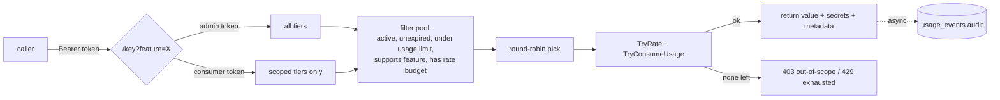

<div align="center">

# 🔑 keypooler

**One source of truth for API keys in the orkait stack.** Round-robin rotation, per-feature rate limits, monthly usage budgets, scoped consumers, bound secrets, and opt-in encryption at rest.

[](https://keypooler.orkait.com)
[](https://go.dev)
[](#-tech)
[](https://turso.tech)
[](https://railway.app)

</div>

> 🌐 **Deployed and managed:** live at **[keypooler.orkait.com](https://keypooler.orkait.com)**, running on **Railway** (project `orkait/keypooler`), backed by a **Turso** libSQL database in the `orkait-eu` group (Ireland). Deploy with `railway up --service keypooler --detach` from the repo root.

Other services (e.g. the siphon runner) call keypooler to obtain a usable key for a feature. They never store, rotate, or decrypt credentials themselves.

```
caller  ──►  GET /key?feature=firecrawl_scrape  ──►  keypooler picks a key  ──►  { value, secrets, metadata }
                                                          │
                                                          ├─ scope-filters to the caller's allowed tiers
                                                          ├─ round-robins across the pool
                                                          ├─ enforces per-feature rate + usage budgets
                                                          └─ audits the serve
```

## 🧭 What it does

| Capability | Detail |
|---|---|
| 🔄 **Rotation** | Round-robin across all keys in a tier; exhausted keys are skipped, the next is tried. |
| ⏱️ **Rate limits** | Per-feature, windowed (e.g. 10 calls / 60s). Defined on the tier, applied per key. |
| 📅 **Usage budgets** | Per-key `usage_limit` with an optional `usage_window_seconds` (e.g. 2592000 = monthly auto-reset). `nil` window = lifetime cap. |
| 👤 **Scoped consumers** | Each client gets a bearer token scoped to specific tiers. The admin token is a superuser. |
| 🔗 **Bound secrets** | Extra named secrets travel with a key (e.g. a Firecrawl `webhook_secret`), returned at serve time. |
| 🔐 **Opt-in encryption** | Plaintext at rest by default; set `ENCRYPTION_KEY` to encrypt new writes. Self-tagged, so both coexist. |
| 📜 **Audit** | Every serve appends a `usage_events` row (key, consumer, feature, time). |
| ⏳ **Expiry** | Optional `expires_at` per key; expired keys leave the pool automatically. |

## 🏗️ Architecture

Keys live in **tiers**. A tier names the features it covers and the rate limit for each. **Consumers** are scoped clients that may only draw from the tiers they are granted. The admin token bypasses scoping.



**Auth model**

| Caller | `/key` access | `/admin/*` |
|---|---|---|
| Admin token | every tier (superuser) | full |
| Consumer token | only granted tiers (`401` unknown, `403` out-of-scope) | denied |

<details>
<summary>🗄️ <b>Data model</b> (7 tables)</summary>

| Table | Holds |
|---|---|
| `tiers` | feature group + `description` |
| `tier_features` | per-feature `rate_limit` + `window_seconds` |
| `keys` | the key value (`plaintext` or `enc:gcm:…`), tier, `expires_at`, `usage_limit`, `usage_window_seconds/start`, `metadata_json` |
| `key_secrets` | named secrets bound to a key (e.g. `webhook_secret`) |
| `consumers` | scoped clients, bearer token stored sha256-hashed (shown once) |
| `consumer_scopes` | which tiers a consumer may draw from |
| `usage_events` | append-only audit, one row per serve |

Migrations are a single consolidated `migrations/001_init.sql` (destructive DROP+CREATE). FK enforcement is off on SQLite/libSQL, so deletes do explicit transactional child cleanup.
</details>

## 🔐 Encryption (opt-in, plaintext default)

Storage is self-describing. Each value carries a scheme tag, so plaintext and encrypted rows coexist in one database and the mode can be switched on later with no migration.

```
ENCRYPTION_KEY unset (default)   ──►  key_value = "fc-2c7b07f…"      (plaintext)
ENCRYPTION_KEY set (32-byte hex) ──►  key_value = "enc:gcm:9f3a…"   (AES-256-GCM, hex)

read: decrypt iff the value starts with "enc:gcm:"  ·  a tagged value with no key is a hard error
```

The decision lives in one place (`crypto.Sealer`). Callers always receive the plaintext value from the API response and never need the key.

## 🚀 Quick start

```bash
export ADMIN_TOKEN=$(openssl rand -hex 32)
# optional: export ENCRYPTION_KEY=$(openssl rand -hex 32)   # omit for plaintext at rest

mkdir -p data
go build -o keypooler ./cmd/keypooler          # pure Go, no CGO
./keypooler                                    # local SQLite at ./data/pool.db
# or: DATABASE_URL="libsql://<host>?authToken=<jwt>" ./keypooler   # Turso
```

<details>
<summary>📦 Register a tier, add a key, create a scoped consumer</summary>

```bash
A="Authorization: Bearer $ADMIN_TOKEN"

# 1. create a tier with two rate-limited features
curl -X POST localhost:8080/admin/tiers -H "$A" -H 'Content-Type: application/json' -d '{
  "name": "firecrawl",
  "description": "Firecrawl pooled free-tier accounts",
  "features": { "firecrawl_scrape": {"rate_limit":10,"window_seconds":60},
                "firecrawl_search": {"rate_limit":5,"window_seconds":60} }
}'

# 2. add a key with a monthly 1000-credit budget and a bound webhook secret
curl -X POST localhost:8080/admin/keys -H "$A" -H 'Content-Type: application/json' -d '{
  "name": "firecrawl-01", "key": "fc-xxxx", "tier": "firecrawl",
  "usage_limit": 1000, "usage_window_seconds": 2592000,
  "secrets": { "webhook_secret": "whsec_xxxx" }
}'

# 3. create a consumer and scope it to the tier (token is shown ONCE)
CID=$(curl -s -X POST localhost:8080/admin/consumers -H "$A" -H 'Content-Type: application/json' \
  -d '{"name":"siphon-runner","description":"firecrawl via rotation"}' | jq -r .id)
curl -X POST localhost:8080/admin/consumers/$CID/scopes -H "$A" -H 'Content-Type: application/json' \
  -d '{"tier":"firecrawl"}'

# 4. draw a rotated key (consumer token)
curl localhost:8080/key?feature=firecrawl_scrape -H "Authorization: Bearer <consumer-token>"
```
</details>

## 📡 API

<details>
<summary>Endpoints</summary>

| Method | Path | Auth | Purpose |
|---|---|---|---|
| `GET` | `/health` | public | liveness |
| `GET` | `/key?feature=X` | admin **or** consumer | draw a rotated key for a feature |
| `GET` `POST` `PATCH` | `/admin/tiers` | admin | list / create / update tier features |
| `GET` `POST` | `/admin/keys` | admin | list / add keys |
| `DELETE` | `/admin/keys/{id}` | admin | remove a key (+ its secrets) |
| `GET` `POST` | `/admin/consumers` | admin | list / create consumers |
| `DELETE` | `/admin/consumers/{id}` | admin | remove a consumer (+ its scopes) |
| `POST` | `/admin/consumers/{id}/scopes` | admin | grant a tier scope |
| `GET` | `/admin/usage?limit=N` | admin | audit log |
| `GET` | `/admin/health` | admin | pool size |
</details>

## ⚙️ Configuration

<details>
<summary>Environment variables</summary>

| Var | Default | Notes |
|---|---|---|
| `ADMIN_TOKEN` | *(required)* | superuser bearer token |
| `ENCRYPTION_KEY` | *(empty = plaintext)* | 32-byte hex; when set, new writes are encrypted |
| `DATABASE_URL` | *(empty)* | `libsql://…` Turso URL; set ⇒ Turso, unset ⇒ local SQLite |
| `DB_PATH` | `./data/pool.db` | local SQLite path |
| `DB_MAX_OPEN_CONNS` | `1` | local SQLite must be `1`; a remote libSQL pool may be higher |
| `DB_BUSY_TIMEOUT_MS` | `5000` | local SQLite busy timeout |
| `SERVER_PORT` | `8080` | listen port |
| `SERVER_{READ,WRITE,IDLE,SHUTDOWN}_TIMEOUT_SECONDS` | `30/30/120/30` | HTTP server timeouts |
| `LOG_LEVEL` `LOG_FORMAT` `LOG_REQUESTS` | `info` `json` `true` | logging |
</details>

## 🗂️ Project structure

```
cmd/keypooler/main.go    wires DB, sealer, key pool, HTTP server
internal/
  api/                   handlers, router, middleware, consumer auth
  config/                env config + validation
  crypto/                AES-256-GCM + Sealer (opt-in, self-tagged)
  db/                    libSQL (Turso) + local SQLite adapter, migrations
  keypool/               round-robin pool, rate + usage budgets
  util/                  db context helpers
migrations/001_init.sql  consolidated schema
```

## 🚢 Deployment

Runs on **Railway** as service `keypooler` in the `orkait/keypooler` project, fronted by the custom domain **keypooler.orkait.com**, with a **Turso** libSQL database (`orkait-eu` group, Ireland).

```bash
railway up --service keypooler --detach        # from repo root
```

> ⚠️ Editing `migrations/001_init.sql` does **not** re-migrate an existing DB - the migration version stays `1` and is skipped. To apply a schema change, wipe the database first (drop all tables incl. `schema_migrations`) so the migration re-runs.

## 🧰 Tech

Go 1.22 (CGO-free, fully static binary) · [Turso](https://turso.tech)/libSQL + [modernc.org/sqlite](https://gitlab.com/cznic/sqlite) (both pure Go) · AES-256-GCM · zerolog · stdlib `net/http` · distroless runtime image.
